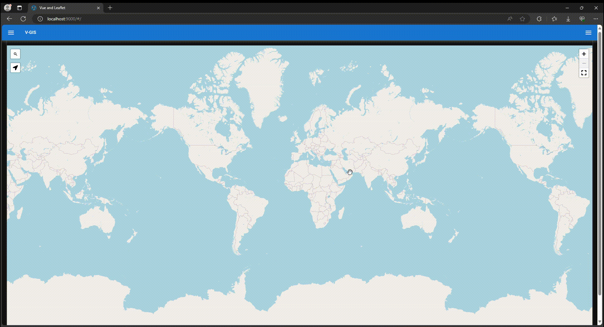
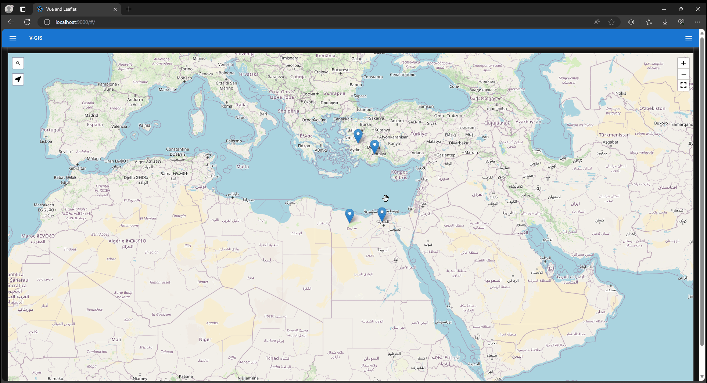

# Vue JS Portfolio
---------------

This section contains my Vue JS projects.

Currently it has some projects:

* [Vue GIS App](https://github.com/MoustafaShaaban/Vue-GIS)

* [Vue Notes App](https://github.com/MoustafaShaaban/Vue_Notes_App)

-------------------------------------------------------------

## Vue GIS

### Project Goals

* Create, Read, Update and Delete (CRUD) geo features.

* Persist features data using the localStorage API.

* Search for features by feature title or description.

### Live Preview

[Vue Notes App](https://moustafashaaban.github.io/Vue-GIS/)


### Project Review

* Project Review:



* Adding Data:


* Filtering Data:


* Sort and Update Data:



* Delete Data and Search for new places:


### Get started with this project

* Clone the repository: git clone https://github.com/MoustafaShaaban/Vue-GIS.git

* Change directory to Vue-GIS directory ``` cd Vue-GIS ```

* Install the packages ``` npm install ```

* Run the development server ``` quasar dev ```


### Libraries and Packages used

* [Vue.js 3](https://vuejs.org/)

* [Quasar Framework](https://quasar.dev/)

* [Pinia](https://pinia.vuejs.org/)

* [VueUse](https://vueuse.org/)

* [Leaflet JS](https://leafletjs.com/)

-----------------------------------------------------------------------------------------

## Vue Notes App

### Project Goals

* Create, Read, Update and Delete (CRUD) notes.

* Create, Read, Update and Delete (CRUD) note tags.

* Link notes by tags.

* Persist Notes and Tags using the localStorage API.

* Search for notes by note title or content.

### Live Preview

[Vue Notes App](https://moustafashaaban.github.io/Vue_Notes_App/)


### Get started with this project

* Clone the repository: git clone https://github.com/MoustafaShaaban/Vue_Notes_App.git

* Change directory to Vue_Notes_App directory ``` cd Vue_Notes_App ```

* Install the packages ``` npm install ```

* Run the development server ``` npm run dev ```

* Open the web browser and go to ` http://localhost:5173/ ` to see the results.


### Libraries and Packages used

* [Vue.js 3](https://vuejs.org/)

* [Quasar Framework](https://quasar.dev/)

* [Pinia](https://pinia.vuejs.org/)

* [VueUse](https://vueuse.org/)

* [Vue-multiselect](https://vue-multiselect.js.org/)

-----------------------------------------------------------------------------------------