# Create a Django project

In this tutorial we will learn how to create a new Django project, and how to render an HTML template in the website's home page.


### Steps:

	* Make sure that Python and pip are installed
	* Create a virtual environment.
	* Start a Django project, create and register a new app
	* Create a Django view and template
	* Register the view in a URL configuration file
	* Run the Django server to view the results.


## Make sure that Python and pip are installed

To make sure that Python and pip are installed. Open your CMD or terminal and run the following commands:

``` python --version ```

This command should return something like the following image:

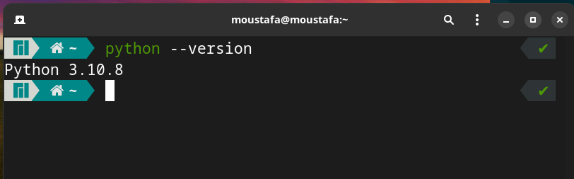

This means that Python version 3.10.8 is installed in my system, If you got an error saying that ``` 'python' is not recognized as an internal or external command, operable program or batch file``` this means that Python is not installed on your system, or, is not added to path.

If you got this error you can read my tutorial about how to install and configure Python on windows, You can find it (here)[https://moustafashaaban.github.io/tutorials/General/1-Installing_Python/python/]


Next, run this command to check if pip is installed

``` pip --version ```

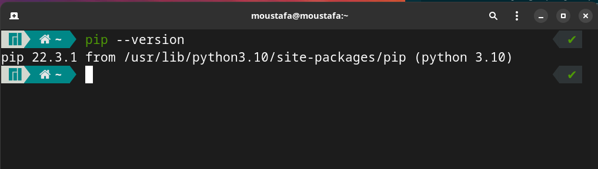

As you can see I have pip version 22.3.1 installed.


----------------------------------------------------------

## Create a virtual environment.

Now let's create a directory in our desktop called 'website' that will contain our project files.

` cd Desktop `

` mkdir website `

` cd website `

Create a Virtual Environment and activate it:

` python -m venv venv `

` source venv/bin/activate`

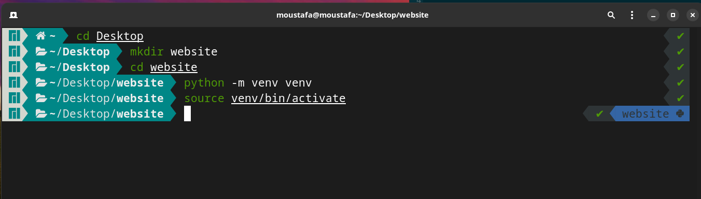

Now that our venv is activated let's install Django inside it:

` pip install django== 4.1.3`

------------------------------

## Start a Django project, create and register a new app

Now that Django is installed we can start a new project and create a new app.

In the terminal type the following command to create a project called backend:

` django-admin startproject backend `

A new directory called backend will be added to our project directory, change directory to it so we can use the commands that Django gives us which can be run by the manage.py file.

` cd backend `

Create an app called app by running the following command:

` python manage.py startapp app `

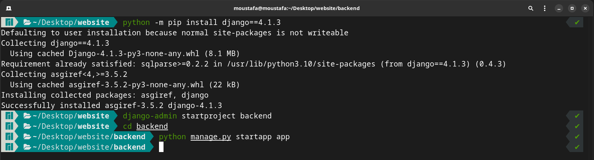

After this, we need to tell Django to use our new app, This is done by adding it to the ` INSTALLED_APPS ` section in the settings.py in our project's directory:

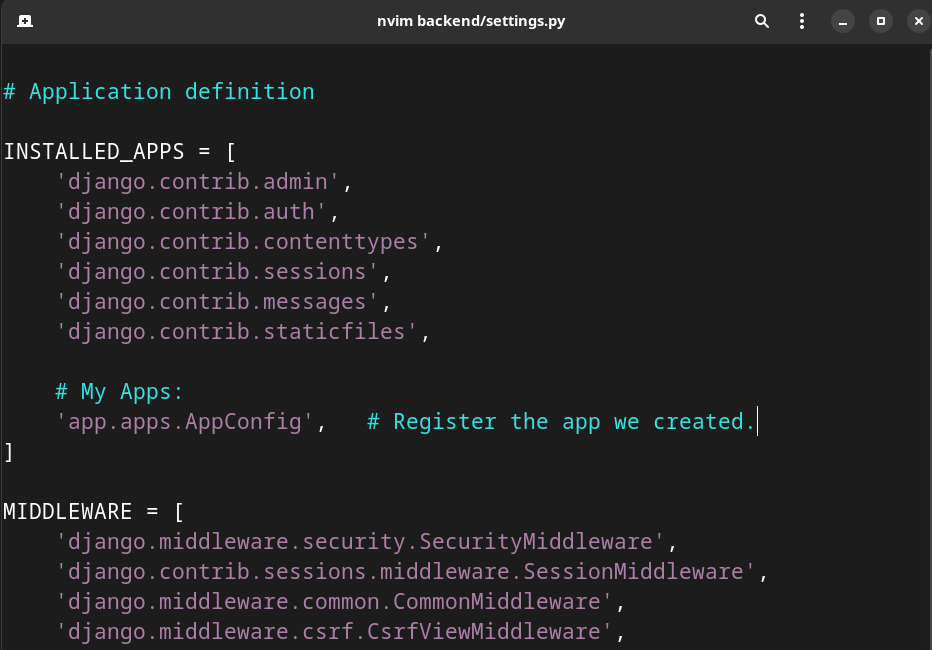


In this tutorial we will use an app-level url configurations, so the last thing we need to do in this step is to create a ` urls/py ` file and map it in our main project ` urls.py `

* Edit `backend/urls.py ` to match the image below:

```
from django.contrib import admin
from django.urls import path, include

urlpatterns = [
	path('admin/', admin.site.urls),
	path('', include('app.urls')),	# We will create this file in the next step
]

```

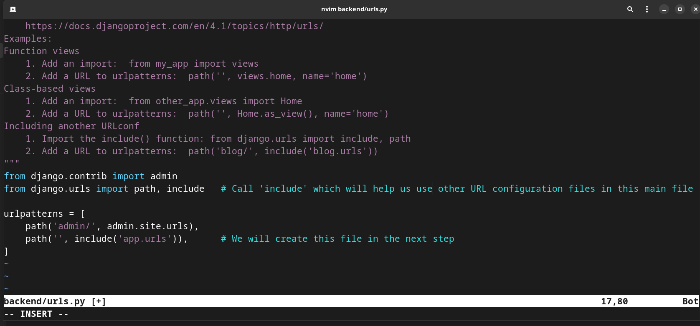


Create a new file called `urls.py` inside the app directory and type the following code inside it:


```
from django.urls import path

urlpatterns = [

]
```
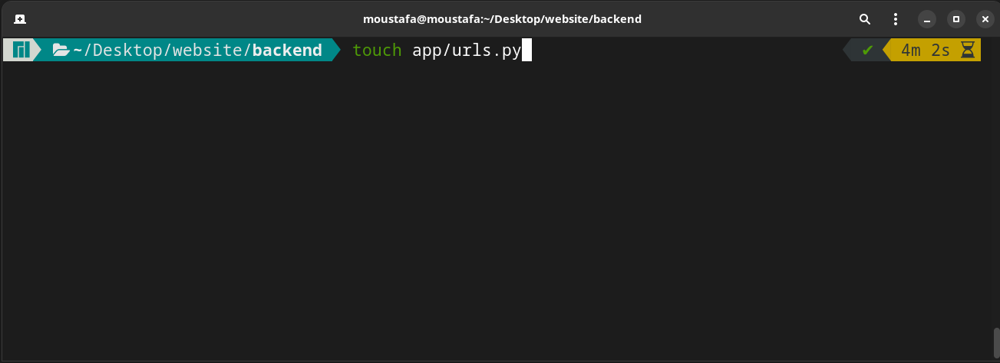

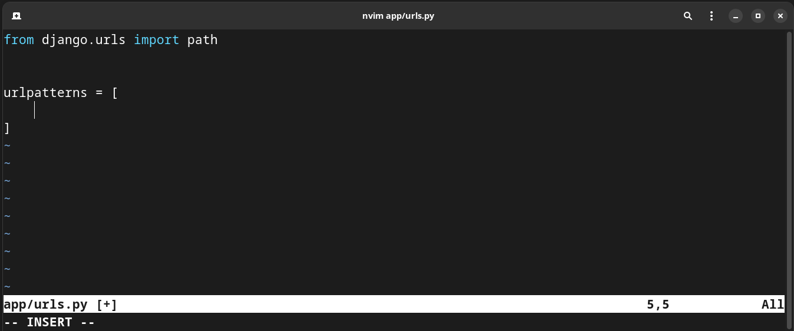

---------------------------------------------------

## Create a Django view and template

According to Django docs, "A view is a callable which takes a request and returns a response". We can define views in Django as a Python Function (FBV) or as a Python Class (CBV), In this tutorial, I will use Fumction-Based views.

We define our views in a file called views.py which is located in our app directory. so, open it and type the following:

```
from django.shortcuts import render


def home(request):
	return render(request, 'home.html')
```

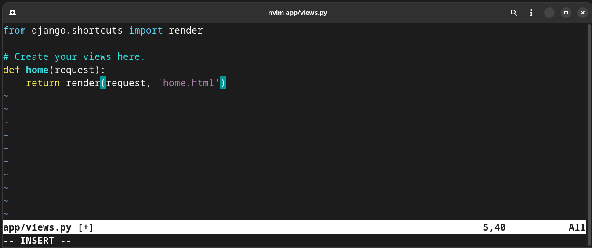


This function takes a parameter `request` and renders an HTML file called `home.html


Now let's create the app-level templates directory and add the `home.html` file inside it:

``` mkdir app/templates ```

``` touch app/templates/home.html ```

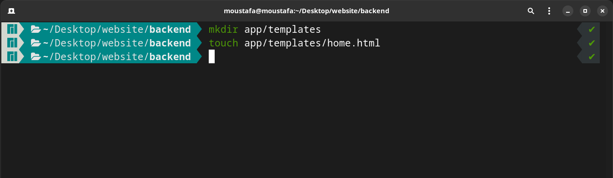


Inside the `home.html` file add the following code to return an h1 tag:

```
<!DOCTYPE html>
<html>
	<head>
		<meta charset='UTF-8'>
		<title>Hello Dlango</title>
	</head>

	<body>
		<h1>Welcome to my home page</h1>
	</body>
</html>
```

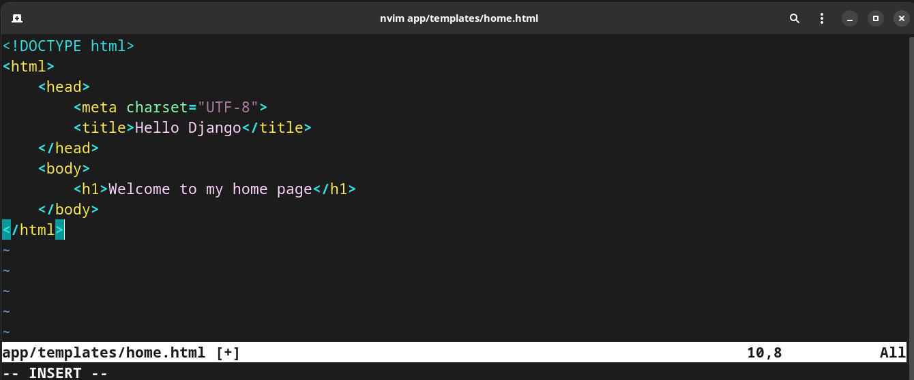

----------------------------------------

## Register the view in a URL configuration file

Now that we have both the view and the template, all we need to do is map the view in our `urls.py` file 


```
app/urls.py

from django.urls import path

from . import views


urlpatterns = [
	path('', views.home, name='home')
]
```

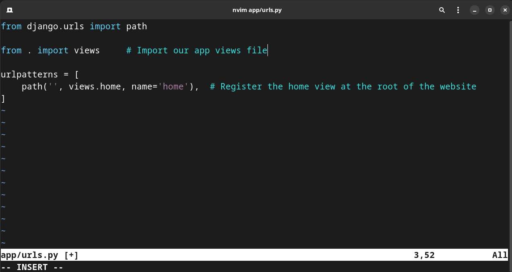


-----------------------------------------------

## Run the Django server to view the results

Inside the terminal type the following command to run the development server:

` python manage.py runserver `

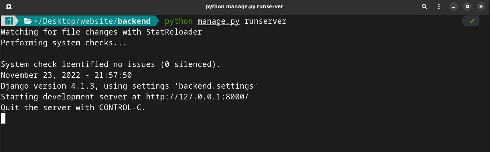

Then open your web browser and navigate this URL: `localhost:8000/` You'll see the following page:

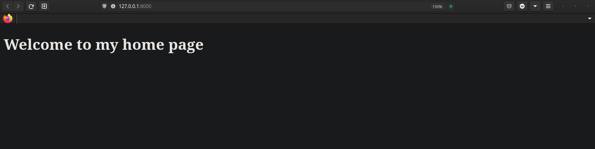

------------------------------------

Now our new Django is running successfully.