# Installing Python on Windows x64:

* In this tutorial we will learn how to install Python 3.9 on windows x64-bit

## Steps

* Check if Python is installed in our machine.
* Downloading Python 3.9 executable file. 
* Installing Python.
* Make sure that Python is installed correctly.

## Check if Python is installed in our machine:

* To check if python is installed in your machine first open start menu and search for cmd to open windows command prompt.

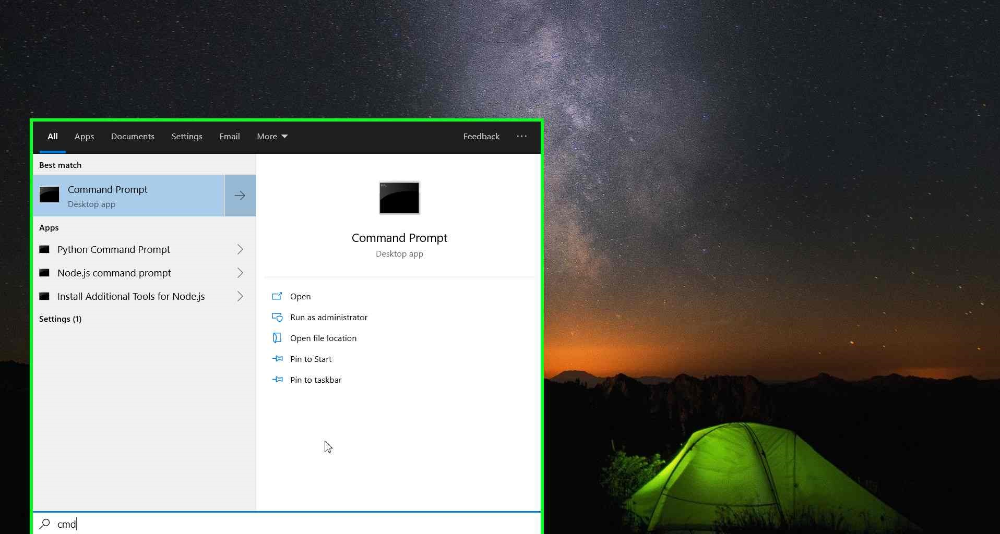

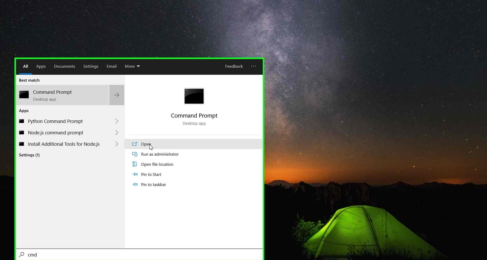

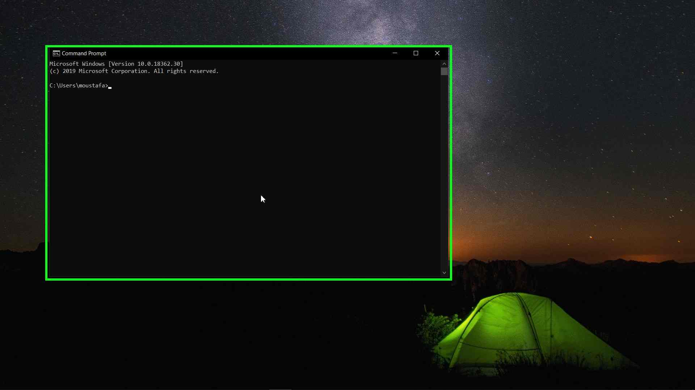

* A cmd window will open, type the following command then click Enter to check the installed version of Python.

    python --version

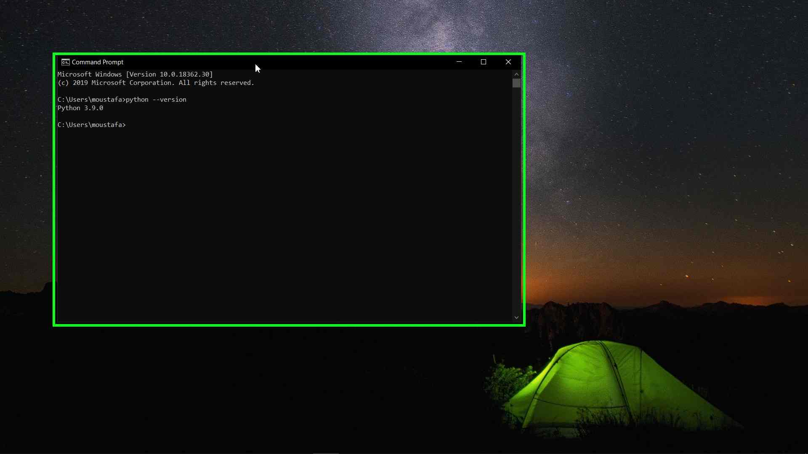

* you will see that Python version 3.9 is installed in my system. But, if you did not installed Python before you will see an output of 

    'python' is not recognized as an internal or external command, operable program or batch file

* This means that either Python is not installed or is not added to windows path environment variable.

* To make sure that Python is really not installed in your system, open start menu again and search for something like Python Command Prompt. If there is no matching output this means that Python is not installed. you can now go to the next step.

## Downloading Python 3.9 executable file:

* Open your web browser (here i am using Microsoft Edge) search bar type Python 3.9 download and click enter to search.

* Click on the second search result 'Python Release Python 3.9.0'

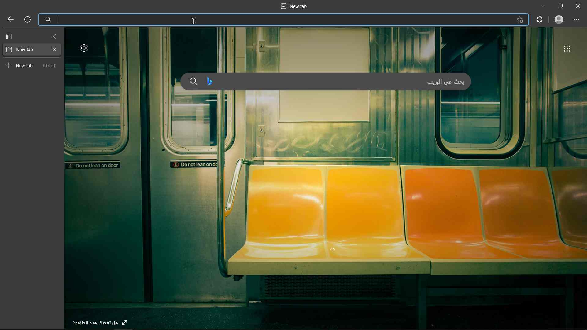

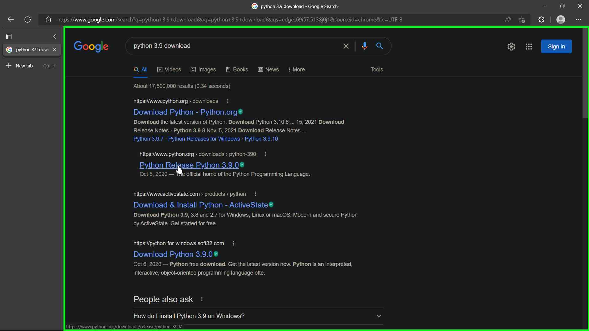

* A new window will open, Scroll down until you see the Files section and then click on 'Windows x86-64 executable installer' to download the file

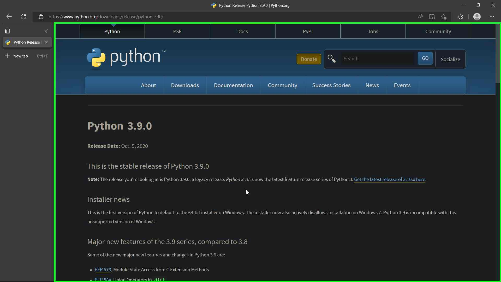

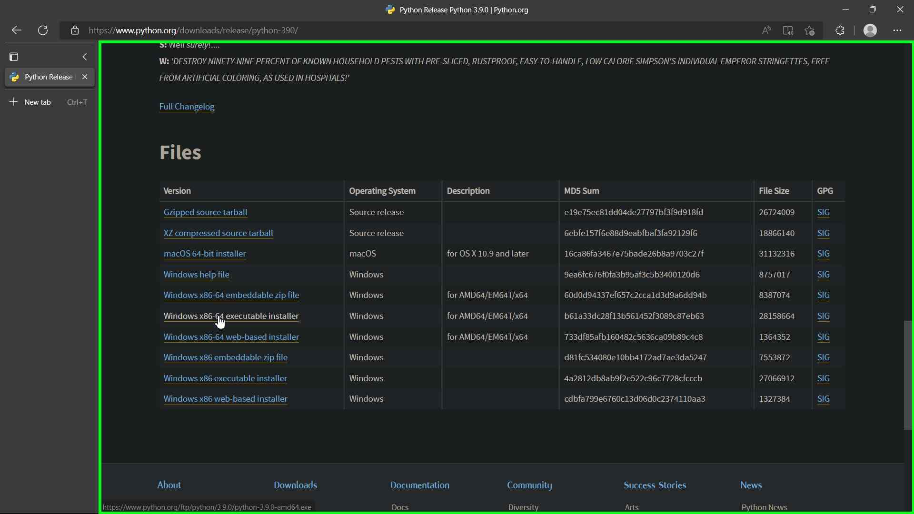

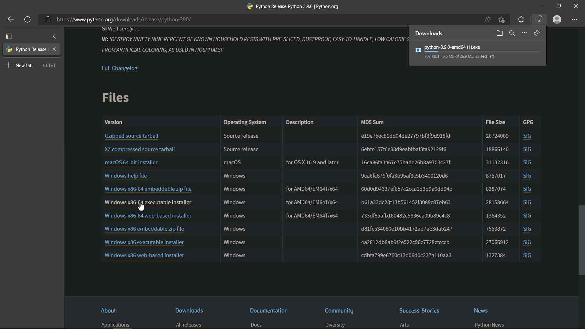

* Now you are ready for the next step.

## Installing Python:

* After you finish downloading the Python file go to your downloads folder and double click on the file to open it:

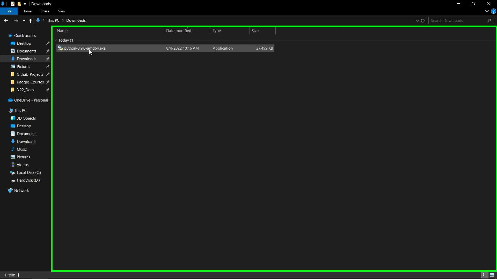

* The Python 3.9.0 installation window will appear.

* Make sure that the following check boxes are checked
  * Install launcher for all users (recommended)
  * Add Python 3.9 to PATH

* These options will install Python for all users of the system and will add the Python files to Windows Path Environment.

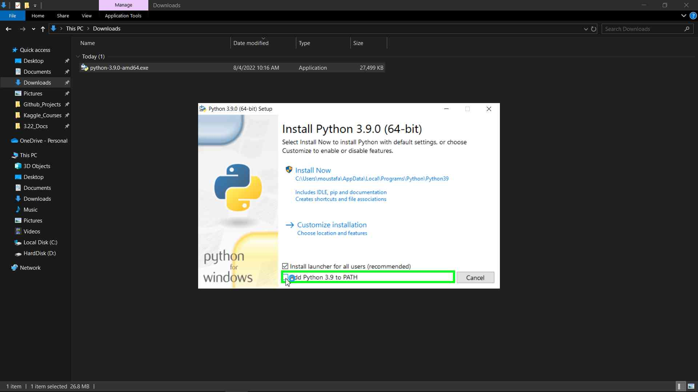

* Now click on Install Now:

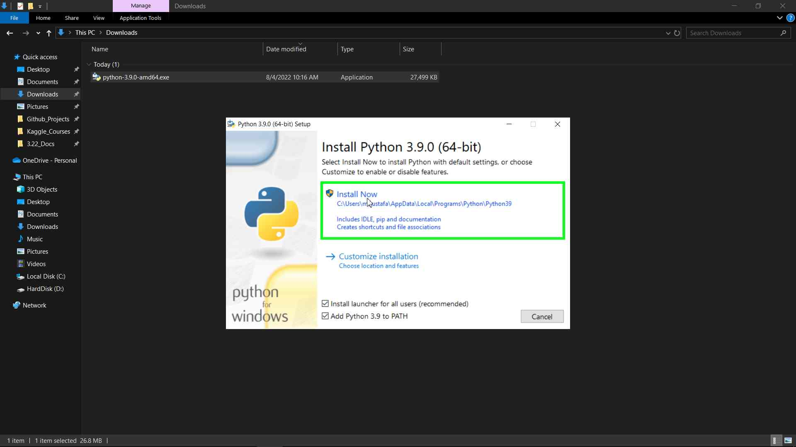

* Click on Yes to allow the install when the User Account Control (UAC) window appear.

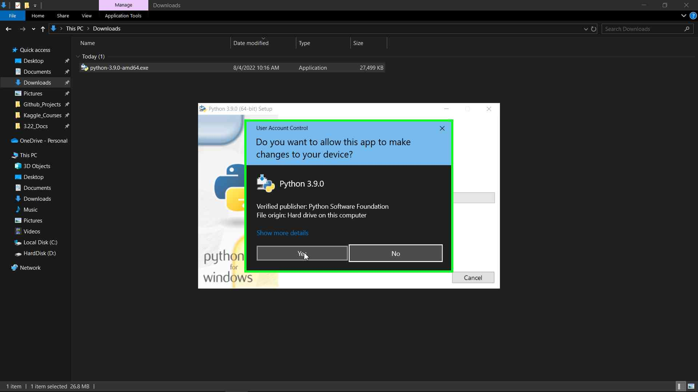

* Now wait until the installation is finished. Then you will see a Setup was successful window appear. Now you can click on Close button.

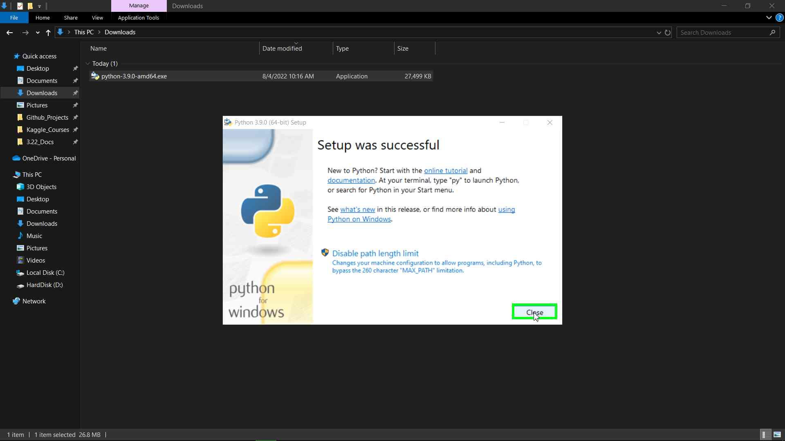

## Make sure that Python is installed correctly:

* Now we can check again if Python is installed correctly in our system like we did in the begaining of this tutorial.

* Open start menu and search for cmd and open it.

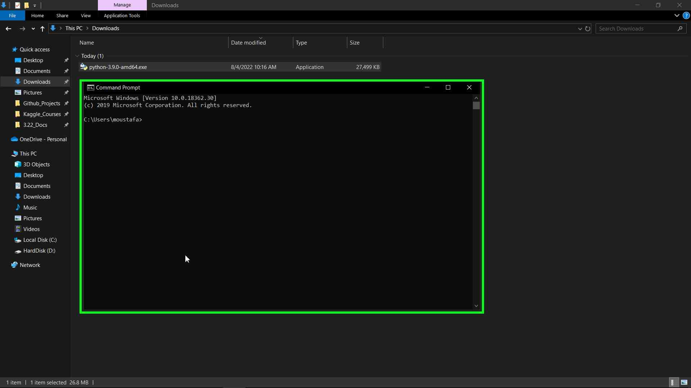

* Type the following command then click Enter to check the installed version of Python.

    python --version

* You will see that Python 3.9.0 is installed:

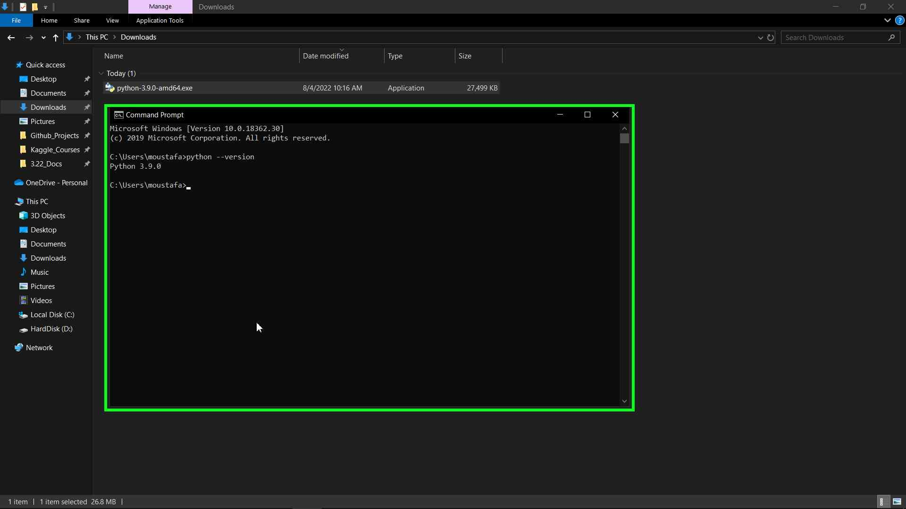

## External Links in this Tutorial:

[Python 3.9.0](https://www.python.org/downloads/release/python-390/)