# Installing Anaconda Distribution on Windows x64:

* This is the the second tutorial in setting a Python development enviroment and tools in our system. You can check the first part by clicking [here](../1-Installing_Python/python.md) to learn how to install Python programming language on your system

* In this tutorial we will learn how to install Anaconda Distribution on windows x64-bit

## Steps

* Download Anaconda Distribution executable file 
* Install Anaconda Distribution.

## Download Anaconda Distribution executable file:

* Open your web browser (here i am using Microsoft Edge) search bar type download Anaconda and click enter to search.

* Click on the first search result 'Anaconda Distribution':

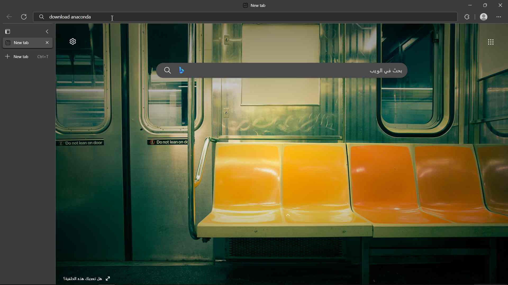

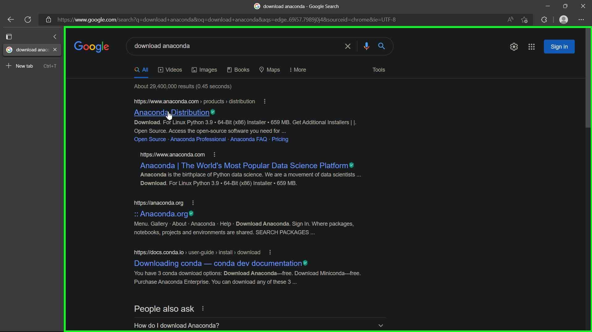

* Now click on the Download button to download Anaconda for windows for Python 3.9 64-Bit:

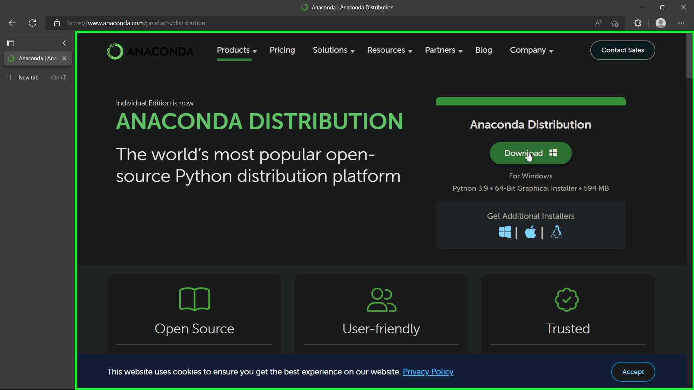

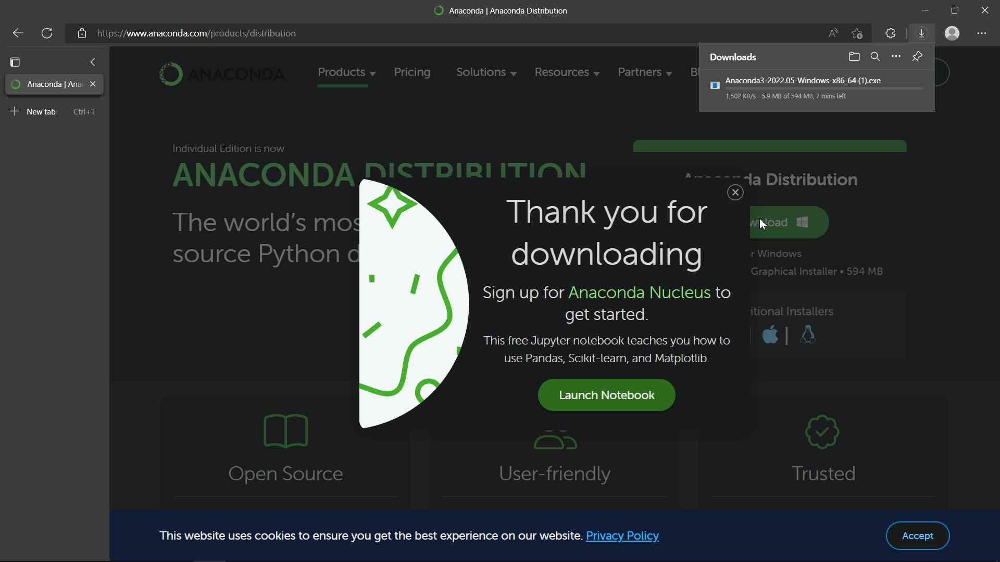

* When the download if finished you will be ready for the next step:

## Install Anaconda Distribution:

* After you finish downloading the Anaconda file go to your downloads folder and double click on the file to open it:

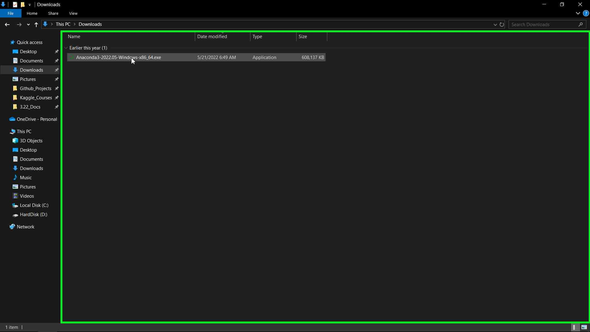

* The Anaconda3 2022.05 (64-bit) installation window will appear.

* Click Next to start the installation:

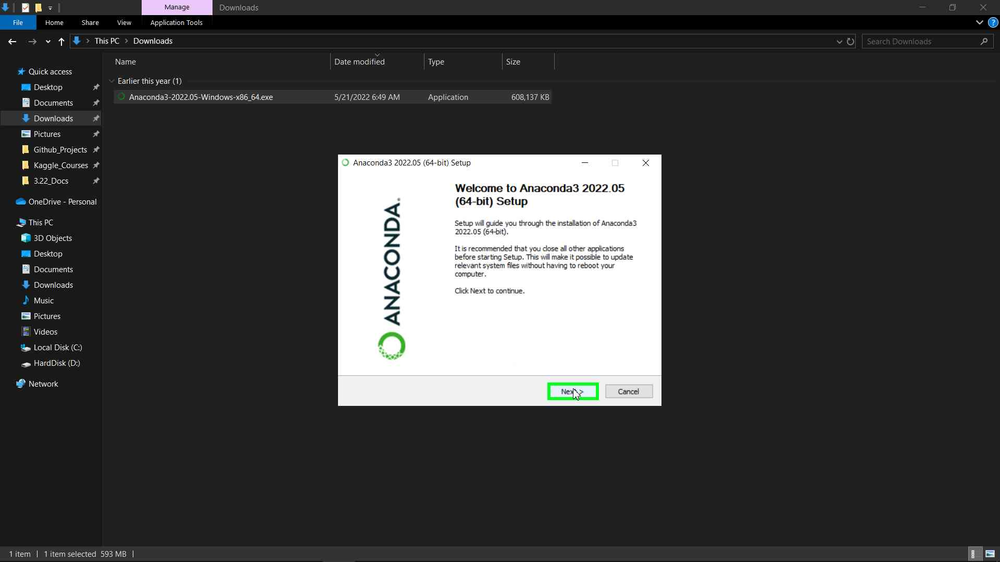

* Click I Agree to accept the License Agreement.

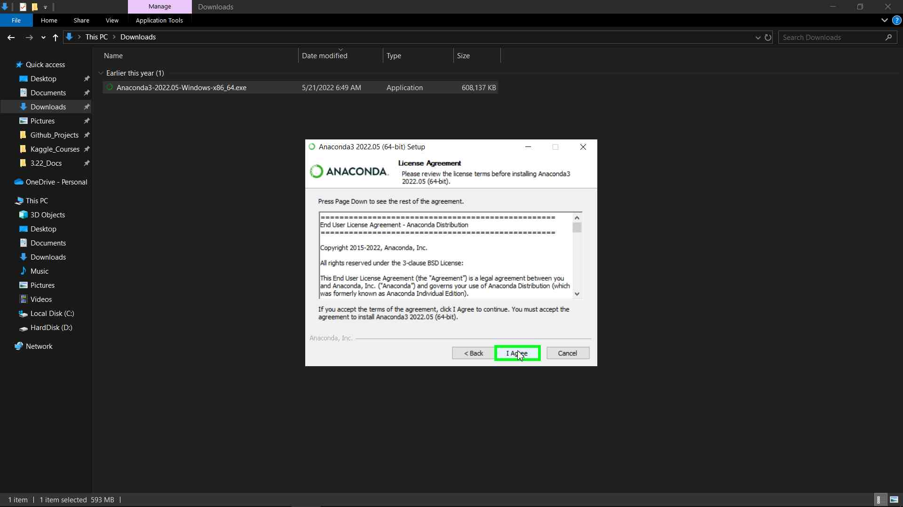

* Keep the Just Me (recommended) radio button on and click Next

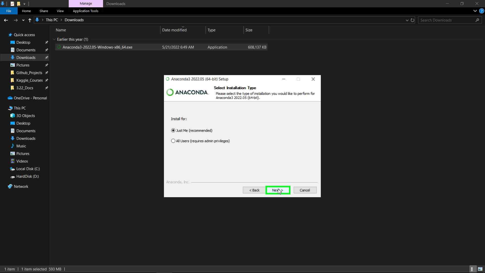

* Choose the install location by clicking on Browse and choose a folder, or click Next to accept the default installation location:

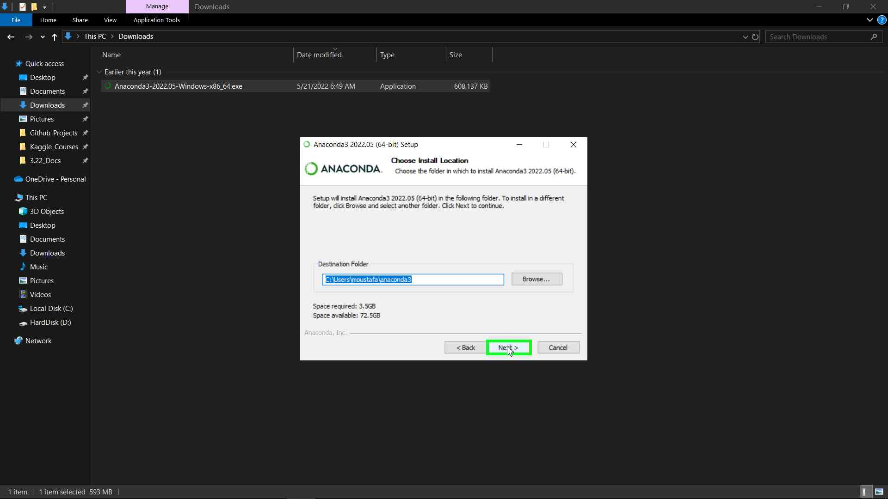

* Keep the both the Advanced Options Unchecked and click Install:

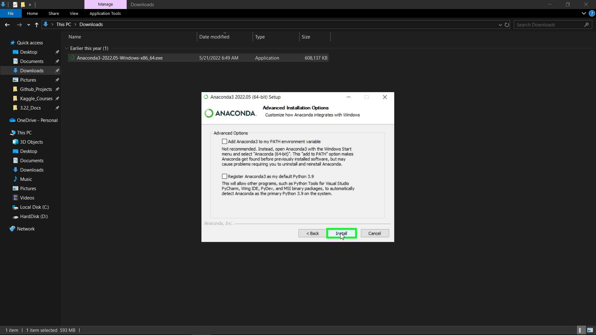

* Wait for the installation to finish:

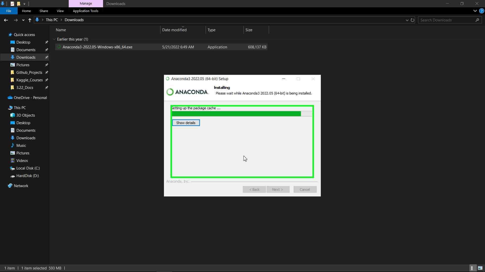

* When the installation is completed click Next:

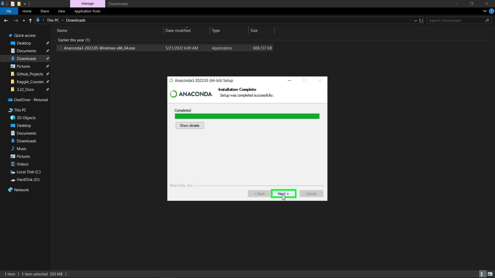

* Click Next again:

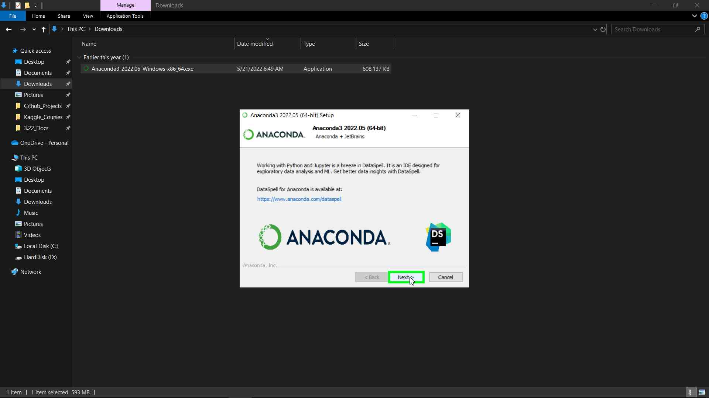

* Finally, uncheck the Anaconda Distribution Tutorial and Getting Started with Anaconda check boxes or leave them checked if you want to learn more about Anaconda and how to use it, and click Finish

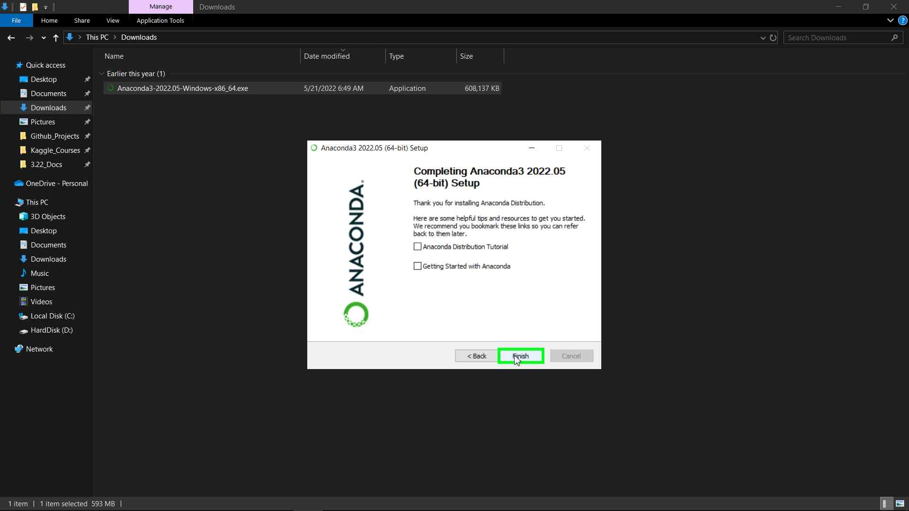

* Now we are done, In the next tutorial we will learn how to create an Anaconda Environment and install [ArcGIS Python API](https://developers.arcgis.com/python/) inside it., You can find this tutorial [here](../3-Creating_Anaconda_Environment/anaconda_environment.md)

## External Links in this Tutorial:

[Anaconda Distribution](https://www.anaconda.com/products/distribution)