# Creating an Anconda Environment amd Installing ArcGIS Python API:

* This is the third tutorial in setting a Python development enviroment and tools in our system. You can find the previous parts here:

* [Install Python 3.9.0](../1-Installing_Python/python.md)

* [Install Anaconda Distribution](../2-Installing_Anaconda/anaconda.md) 

* In this tutorial we will learn how to create an Anaconda virtual environment and install ArcGIS Python API inside it.

* In Python, you can think of virtual environments as boxes where you will install each project dependencies inside it. This is the recommended way to create Python projects.

* You can learn more about Python Virtual Environments in the [Python Docs](https://docs.python.org/3/library/venv.html) website.

* There are many tools to create Python Virtual Environments like (there are other tools but these are some of the popular ones):

  * The built-in tool in Python called [venv](https://docs.python.org/3/library/venv.html)
  
  * [Pipenv](https://pipenv.pypa.io/en/latest/)
  
  * [virtualenvwrapper](https://virtualenvwrapper.readthedocs.io/en/latest/)
  
  * And the one we are going to use in this tutorial [Conda Environments](https://docs.conda.io/projects/conda/en/latest/user-guide/tasks/manage-environments.html)

## Steps

* Create Conda Environment using the GUI tool Anaconda Navigator.
* Activating the newly created conda environment using Anaconda Powershell Prompt.
* Install ArcGIS Python API using pip.

## Create Conda Environment using the GUI tool Anaconda Navigator:

* First, open your start menu and search for Anaconda Navigator and open it:

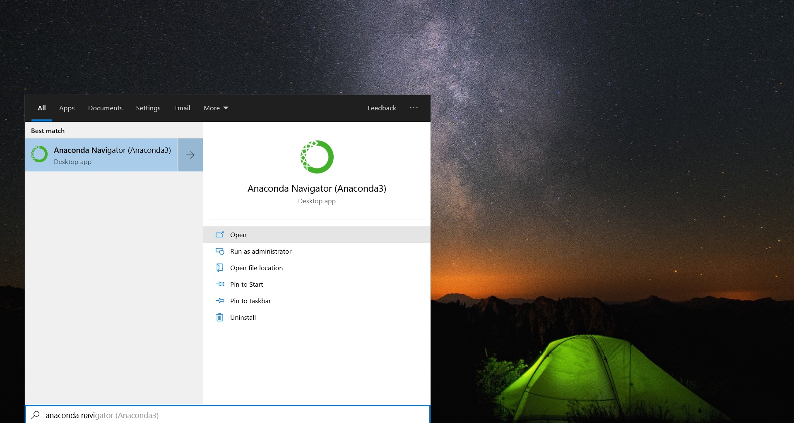

* The Anaconda Navigator window will open. Click on Environments to see the available conda environments:

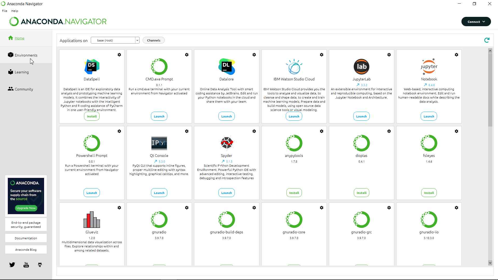

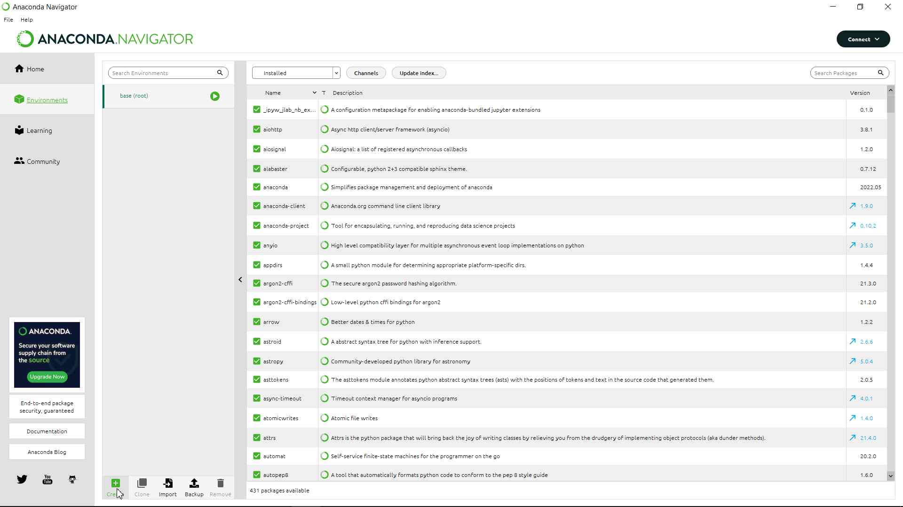

* At the bottom of the screen click on the Create button to add a new conda environment:

* Choose a name for the environment and it will automatically choose Python Packages and Version.

* Click on Create, then wait for the task to complete:

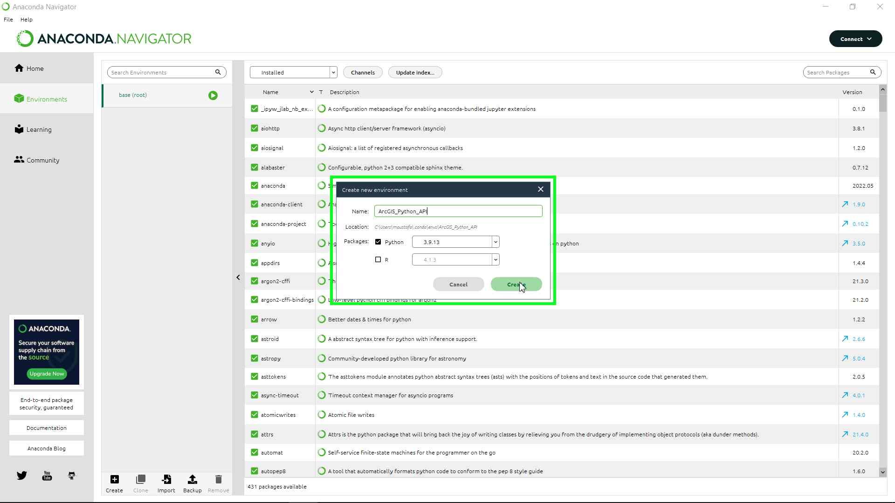

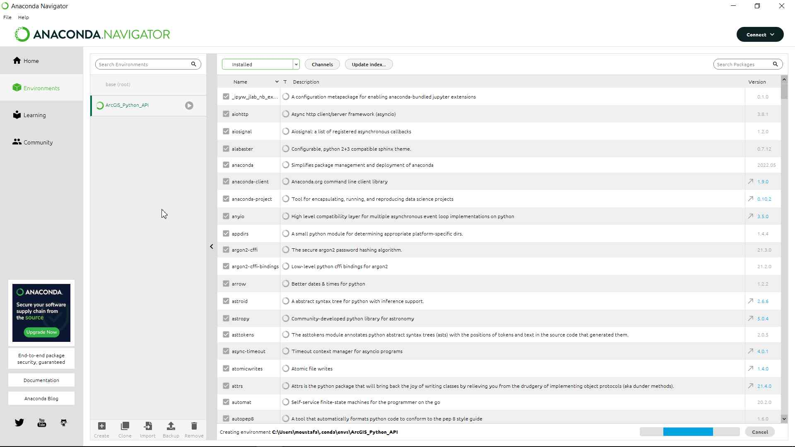

* You will see a new environment added to the list:

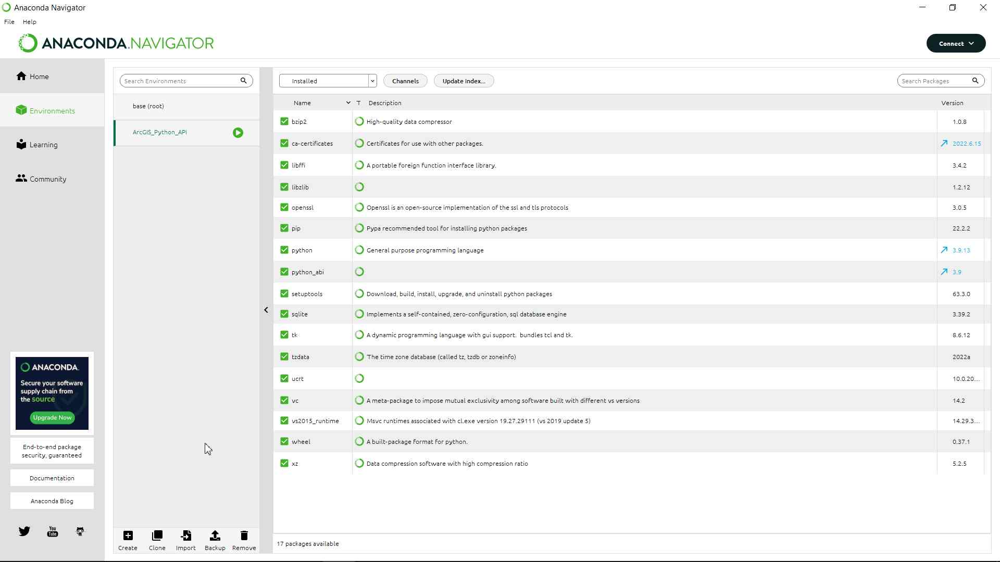

## Activating the newly created conda environment using Anaconda Powershell Prompt:

* Now that our conda environment is created, we need to activate it.

* Open your start menu and search for Anaconda Powershell Prompt and open it:

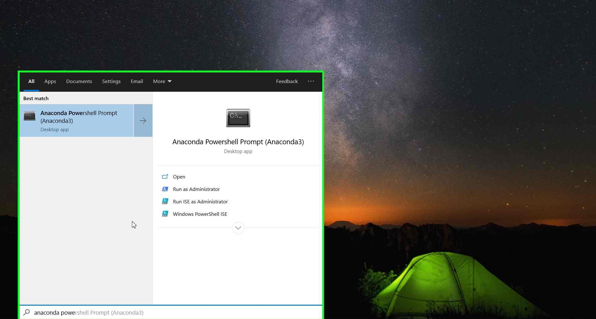

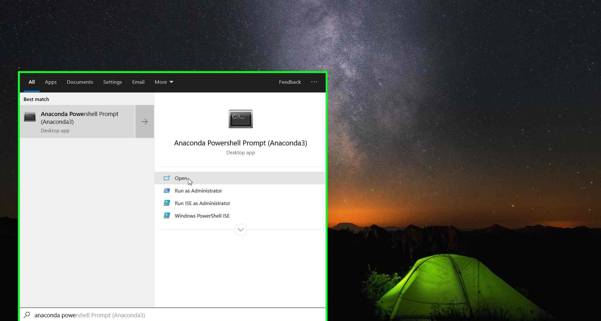

* An Anaconda Powershell window will appear.

* You will notice that the (base) conda environment is curruntly active. We do not want that. So type the following command and click Enter to activate the required env:

    conda activate ArcGIS_Python_API

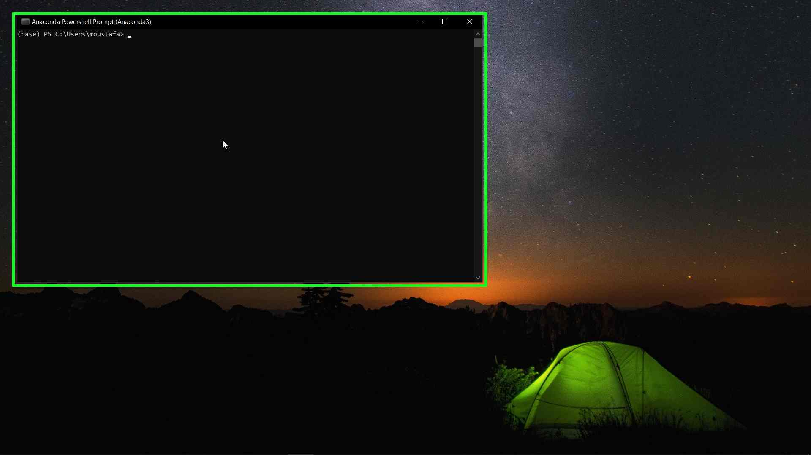

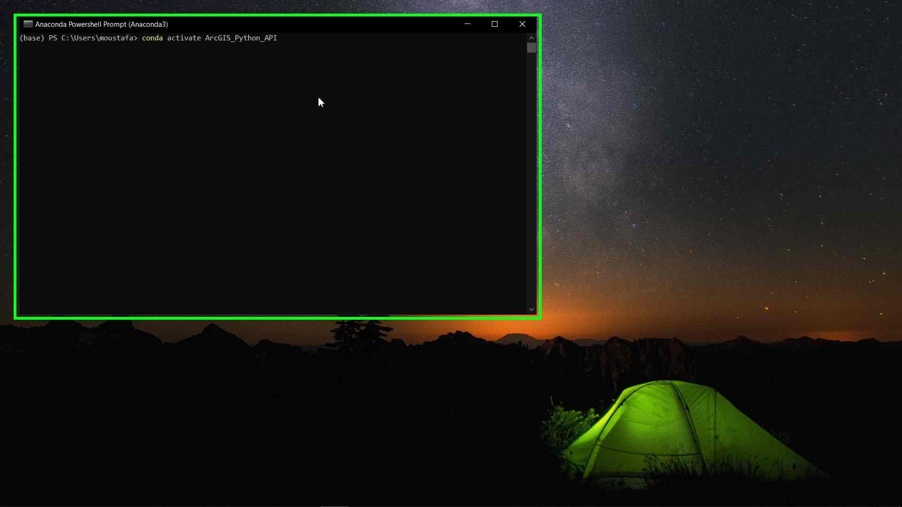

* Now you will see that the (ArcGIS_Python_API) environment is active:

* And we are ready for the final step.

## Install ArcGIS Python API using pip:

* After activating the required environment all we need is to type one single command which is:

    pip install arcgis

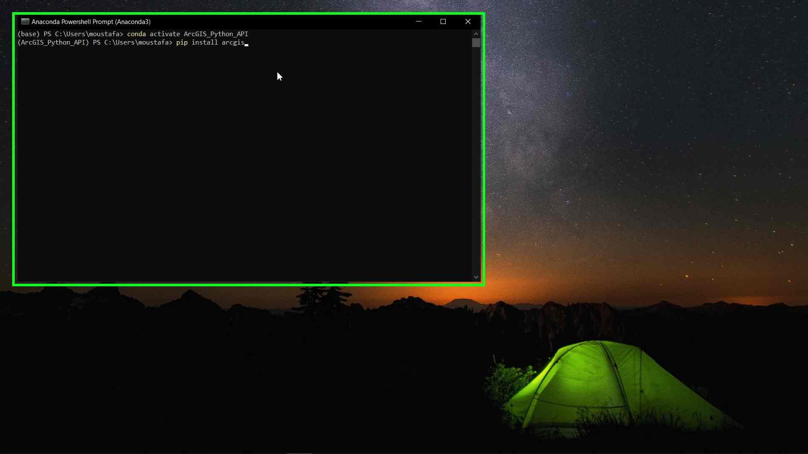

* Wait until the command finish and make sure that there are no errors appears.

* And that is it for our tutorial. In the next tutorial we will learn how to install Microsoft VS Code and add some of the recommended extensions to it.

* You can find this tutorial [here](../4-Install_VS_Code/vs_code.md)

## External Links in this Tutorial:

* [Conda Environments](https://docs.conda.io/projects/conda/en/latest/user-guide/tasks/manage-environments.html)

* [ArcGIS Python API Installation](https://developers.arcgis.com/python/guide/install-and-set-up/)
